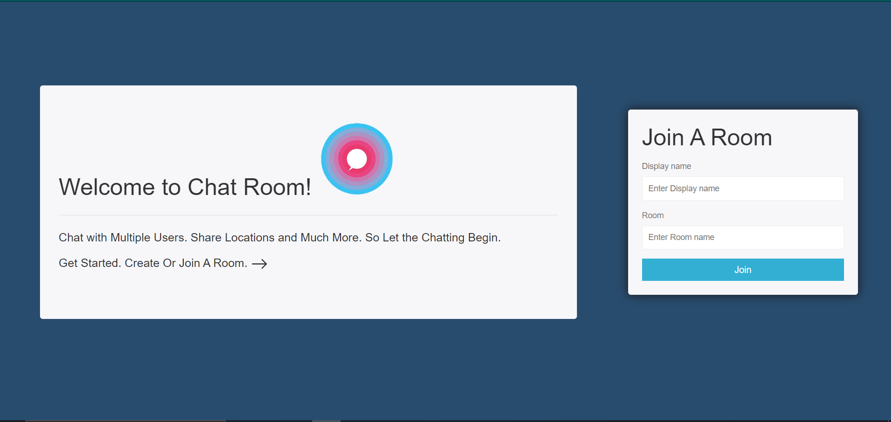
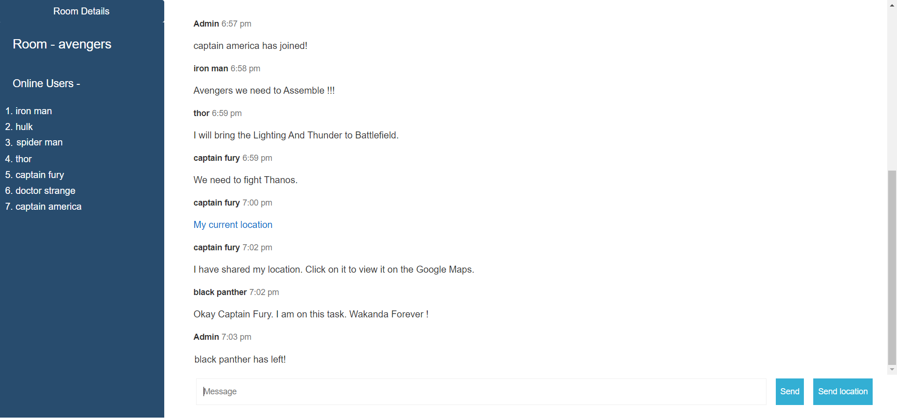
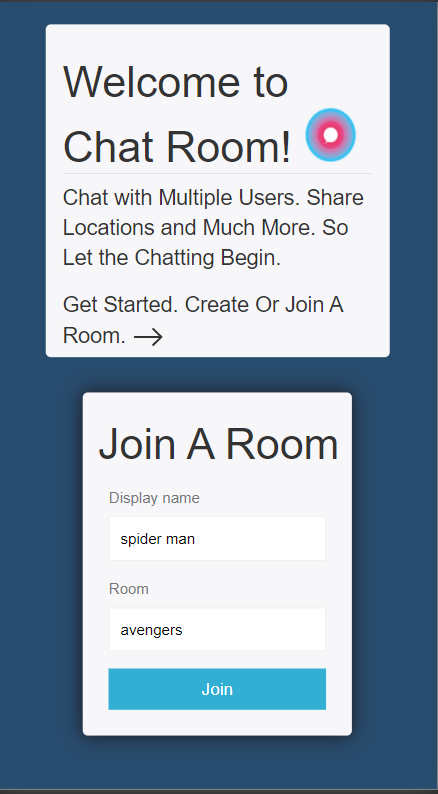
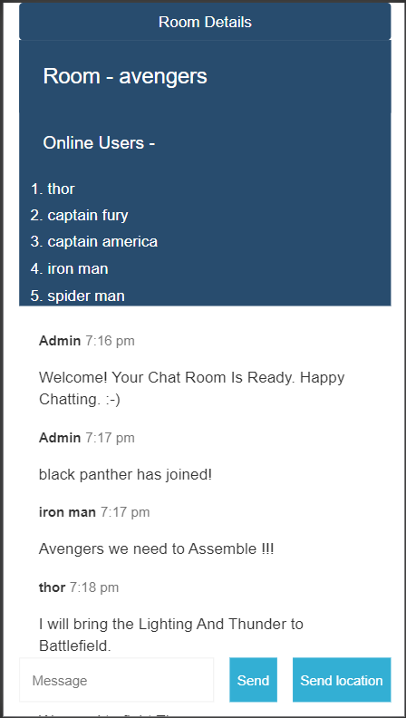
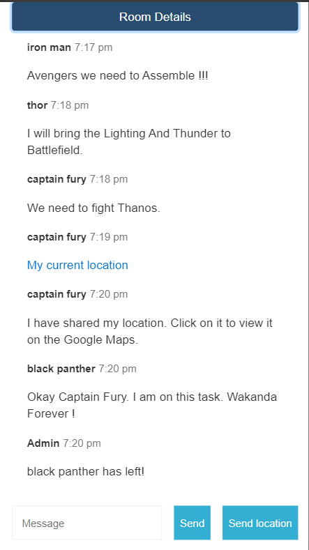

# Chat-Room

**<ins>A Simple Full Stack Website Implementing Websockets For Live Chat.</ins>**

**Welcome to Chat Room Website. Chat Room Website is a Simple Chat Experience where you can Chat with Multiple People Online. To start your Chat enter Display Name And enter Room Name. You can Create a New Room Or Join an Existing Room created by other User. There is also a Feature to Share your Live Location with Other Users. So what are you waiting for... Start Chatting Now.**

**<ins>Check It Out At</ins> -**  https://chat-room-v.herokuapp.com/   **(live hosting @Heroku).**

**<ins>Features Of The Website</ins> -**

**Live Chat with Mulitple Users Simultaneously  ||  To Start A Chat Just Choose A Display And A Room Name.**

**Create A New Chat Room Or Join A Existing Room.  ||  See Other Users Online in Your Room.**

**Feature to Send Live Location ||  Live Location can be viewed on Google Maps.**

**Can be used on Both Desktop And Mobile Devices.**

**<ins>Technologies Used</ins> -**

**Frontend- Using HTML, JavaScript, CSS.  ||  Backend- Using Node Js.**

**<ins>Packages and API's Used</ins> -**

**Express as Web Framework.  ||  Socket.io for Realtime Data Flow   || Bootsrap For Dynamic Mobile View.**

**<ins>Desktop View</ins> -**

 

 

**<ins>Mobile View</ins> -**

  
